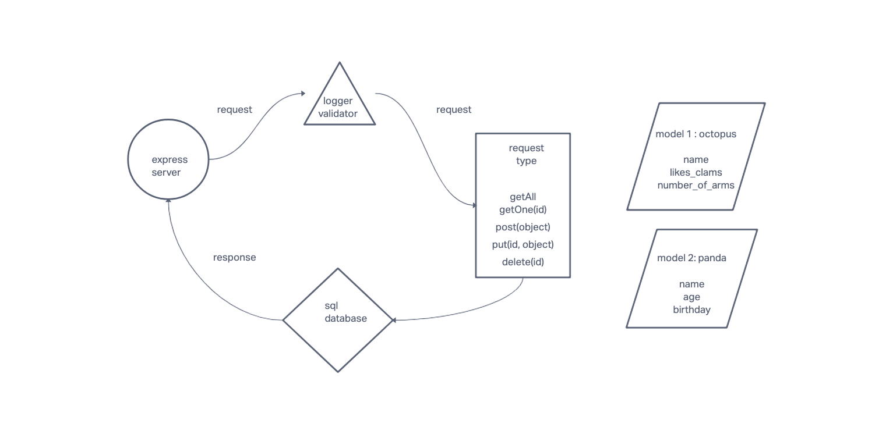

# Documentation for api-server

## Description

This is an Express server written in Node.js

## Release Notes

05 Apr 2023 | 1.0.0 | First build

15 Apr 2023 | 1.1.0 | Working build: models, collection, DB, routes

16 Apr 2023 | 1.2.0 | Added model associations : One TO One relationship

## Deployment

Deployed to Render [https://api-server-x4pm.onrender.com]

## Partner programming

Notes from partner programming lab 04: my server is still very much a work in progress and it was good to get eyes on another one to see where some functionality is missing, and where it's reasonably well developed. Both of our repos are very short on test functionality.

Pull request for my fork of Phil's repo is here [https://github.com/pchapl1/api-server/pull/7]

Phil's pull request to my repo is here [https://github.com/pchapl1/api-server/pull/7]

## Assignment Instructions: Lab 03 Express REST API

### Dynamic API Phase 2: Perform CRUD Operations on a database

#### Before you begin

Refer to the Getting Started guide in the lab submission instructions
Create a new repository called api-server.
Work in a new branch called basic-api, created from main.
Following completion of this assignment, create a Pull Request from basic-api to main and merge your code.
You will deploy from your main branch to a new app at your cloud service provider.
You will add a link to the PR that you merged in your README for grading purposes.
Phase 2 Requirements
Build a REST API using Express, by creating a proper series of endpoints that perform CRUD operations on a Postgres SQL Database, using the REST standard.

#### UML Whiteboard

#### SQL Models

Create 2 SQL data models using the Sequelize library, make sure you export those model instances.
Make sure your Models are configured with your SQL dialect and can properly connect to your database.
Your models should have appropriate field names declared with specific sequelize DataTypes.
For the data models, you are free to choose your own data types and describe their fields … For Example: person, animal, car, instrument, game

#### Model Associations

Add an association between your models. Utilize the Sequelize docs if helpful.
One-To-One association:
GET on the hasOne side should include the entire entity it has.
GET on the belongsTo side should include a property with a link to the entity it belongs to.
One-To-Many association:
GET on the hasMany side should include a property with the URL to access the list of items it has.
Hint: use a nested route on the parent collection, or a query parameter with the parent ID.
GET on the belongsTo side should include a property with a link to the entity it belongs to.
Many-To-Many association:
GET will involve two belongsToMany associations both of which include a property with a link to the entity it belongs to through a 3rd join table.

#### Routes

In your express server, create a route module for each data model that you’ve created. Within the router module, create REST route handlers for each of the REST Methods that properly calls the correct CRUD method from the matching data model.

For these examples, we’ll use ‘food`

Add a Record
CRUD Operation: Create
REST Method: POST
Path: /food
Input: JSON Object in the Request Body
Returns: The record that was added to the database.
You must generate an ID and attach it to the object.
You should verify that only the fields you define get saved as a record.

Get All Records
CRUD Operation: Read
REST Method: GET
Path: /food
Returns: An array of objects, each object being one entry from your database.

Get One Record
CRUD Operation: Read
REST Method: GET
Path: /food/1
Returns: The object from the database, which has the id matching that which is in the path.

Update a Record
CRUD Operation: Update
REST Method: PUT
Path: /food/1
Input: JSON Object in the Request Body
Returns: The object from the database, which has the id matching that which is in the path, with the updated/changed data.
You should verify that only the fields you define get saved as a record.

Delete a Record
CRUD Operation: Destroy
REST Method: DELETE
Path: /food/1
Returns: The record from the database as it exists after you delete it (i.e. null).

#### Implementation Notes

REMINDER: Your app needs a new dependency today: sequelize

npm i sequelize sequelize-cli pg sqlite3

Remember to start your Postgres server:

Windows and Linux Users: pg_ctl -D /home/linuxbrew/.linuxbrew/var/postgres start
Mac Users: brew services start postgres

#### Create an express server with the following proposed structure

├── .github
│   ├── workflows
│   │   └── node.yml
├── config
│   ├── config.json
├── __tests__
│   ├── server.test.js (integration test)
├── src
│   ├── error-handlers
│   │   ├── 404.js
│   │   ├── 500.js
│   ├── middleware
│   │   ├── logger
│   │   ├── logger.test.js (unit test)
│   │   ├── validator.js
│   ├── models
│   │   ├── index.js
│   │   ├── food.js
│   │   ├── clothes.js
│   ├── routes
│   │   ├── food.js
│   │   └── clothes.js
│   └── server.js
├── .eslintrc.json
├── .gitignore
├── index.js
├── package.json
└── README.md

In your server.js, require() your router modules, and use() them.
In your routers, require() the correct data model and instantiate a new instance.

#### Testing Requirements

DONE

- Assert the following
  - 404 on a bad route
  - 404 on a bad method

DONE

- The correct status codes and returned data for each REST route
  - Create a record using POST
  - Read a list of records using GET
  - Read a record using GET
  - Update a record using PUT
  - Destroy a record using DELETE
